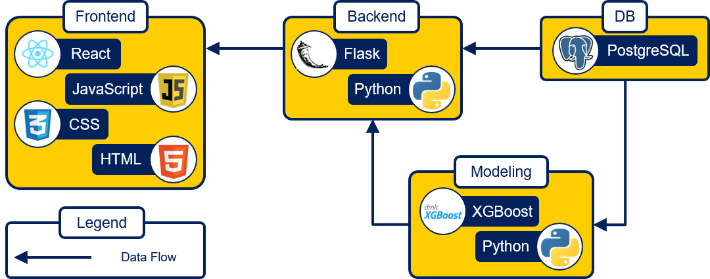
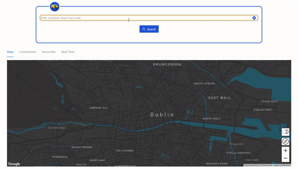

# Dublin Bus Web Application

## Table of contents

- [General info](#general-info)
- [Technologies](#technologies)
- [Setup](#setup)
- [Deployment](#deployment)
- [Demo](#demo)

## General info

The problem we aim to address with this project is providing accurate travel time estimates for Dublin Bus journeys. To fulfill this goal, historic Dublin Bus and weather data is analysed in order to create dynamic travel time estimates. Based on the data analysis, a system which when presented with any start and end point, departure time, and weather condition is created that will produce an accurate estimate of travel time for the complete route and sections of the route.

This project also involves providing an easy to use and powerful interface for users to request travel time estimates. Our main goal for this interface is for its design to be as user focused as possible and enhance User Experience through complementary features.

## Technologies

Project is created with:

- Frontend
  - React Hooks
  - Use-Places-Autocomplete
  - React-google-maps/api
  - Ant Design
  - Material - UI
- Backend
  - Python 3.7+
  - Flask, more specifically Flask RESTful
  - Google directions API
  - Open Weather Map API
  - PostgreSQL
  - XGBoost

## Setup

To run this project, Fork or Clone this repository 'git clone https://github.com/jakobhero/bus.git'. For detailed instructions, refer to the documentation of each component:

- [Backend](backend/README.md)
- [Frontend](web/README.md)

In addition, we provide artefacts of our analytical process for documentation and research purposes. Refer to [Data Analytics](data_analytics/README.md) for more details.

## Architecture

## Deployment

The webapp is currently deployed at https://ipa-003.ucd.ie/ with NGINX and gunicorn.

## Demo

